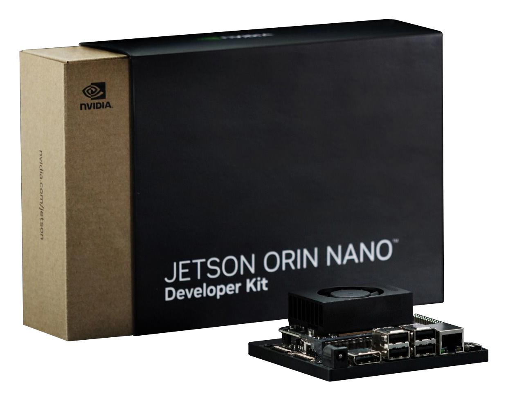

# Overview
A Gradio-based application that uses a vision-language model (llava-onevision-qwen2-0.5b-ov-hf) for real-time webcam image analysis and question answering.

Selecting a VLM model for the Jetson Orin Nano was challenging due to limited RAM. Early attempts with SmolVLM and PaliGemma did not succeed.

## Hardware Requirements

To run this project, you will need the following hardware:

- Jetson Orin Nano
- Microsd card (at least 128GB)
- Microsd card reader
- Display Port cable or DP to HDMI adapter (if your monitor does not support Display Port)
- USB Mouse and keyboard
- USB camera
- Monitor



## Installation
1. Install PyTorch for Jetson platforms. For this project, these were used:

```bash
wget "https://developer.download.nvidia.com/compute/redist/jp/v61/pytorch/torch-2.5.0a0+872d972e41.nv24.08.17622132-cp310-cp310-linux_aarch64.whl" 

pip install --no-cache torch-2.5.0a0+872d972e41.nv24.08.17622132-cp310-cp310-linux_aarch64.whl
```

2. (Optional) Install cuSPARSELt if required by your environment.
3. Fix any `torch._C._distributed_c10d` issues by commenting out the line referencing `dist.get_world_size()` in `transformers/generation/utils.py` if needed.
4. Install the required Python libraries:
```bash
pip install gradio transformers pillow
```
5. (Optional) Download llava-onevision-qwen2-0.5b-ov-hf from Hugging Face if not automatically done.


## Usage

Run:
```python
python main.py
```

A browser tab will open with a webcam feed and a text input field. Enter a question to get a detailed response about the live image.

## Notes
Adjust DEVICE in main.py based on system capabilities.
Increase stream_every in main.py to reduce webcam load if needed.

## References
- https://medium.com/@yixiaozengprc/set-up-pytorch-environment-on-nvidia-jetson-platform-9eda291db716
- https://developer.nvidia.com/cusparselt-downloads?target_os=Linux&target_arch=aarch64-jetson&Compilation=Native&Distribution=Ubuntu&target_version=22.04&target_type=deb_local
- https://forums.developer.nvidia.com/t/modulenotfounderror-no-module-named-torch-c-distributed-c10d-torch-c-is-not-a-package/312799/9
- https://huggingface.co/llava-hf/llava-onevision-qwen2-0.5b-ov-hf
